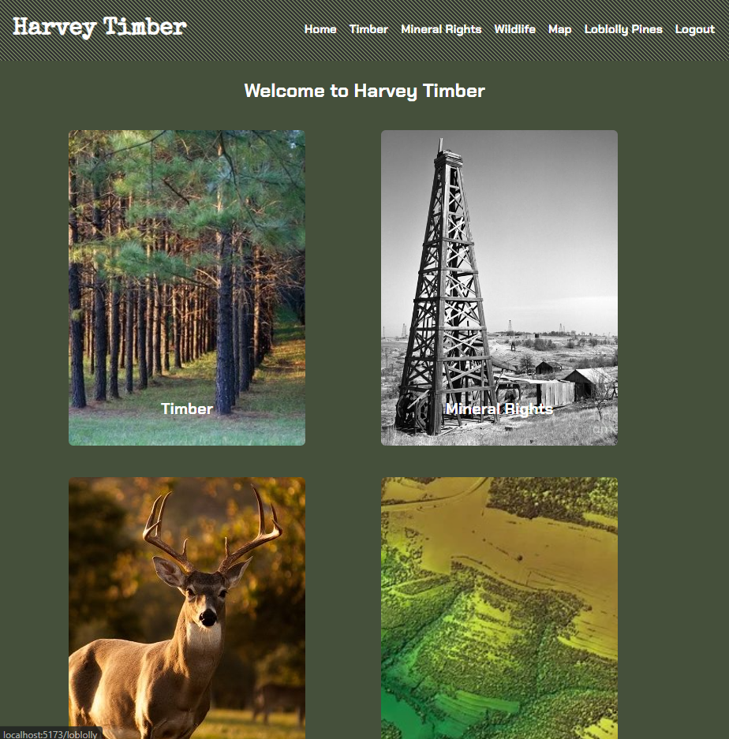

# Harvey Timber

## Table of Contents

* [Description](#description)
* [Installation](#installation)
* [Usage](#usage)
* [Credits](#credits)
* [Screenshots](#screenshots)
* [Video](#video)
* [Link to Website](#link-to-website)
* [License](#license)

## Description

This application is Harvey Timber. Harvey Timber is a React application that utilizes MERN Stack principles. This application allows the user to conduct business with one of the largest and most profitable timber operations in the Southeast United States. The user can Sign Up and access everything that Harvey Timber has to offer as well as contact the CEO of the company. The website also serves as educational experience that allows the user to learn about the timber and oil business and view company operations.

## Installation

The user can access this application by clicking on the link below. In order to install this application locally the user will need to download the code from this resository. The user will need to ensure that the latest versions of Node.js, MongoDB and a code editor such as VSCode are installed on their computer to fully utilize this application. After the code is downloaded, the user will need to enter the following command in the CLI: `npm i` while in the root directory. Next, the `npm start` command will start the client server at http://localhost:5173 and back end server at http://localhost:5000.

## Usage

In order to fully utilize this application, the user will need to Sign Up. Once the user completes the Sign Up process, they will need to ensure they are Signed In and all application functionality will be available. 

## Credits

This project was done by Martin "Gabe" Harvey who is a rising star in the coding world.

## Screenshots

Main Screenshot:

## Video

N/A

## Link to Website

https://harvey-timber.netlify.app/

## License

This application is licensed under The MIT License.

https://opensource.org/licenses/MIT